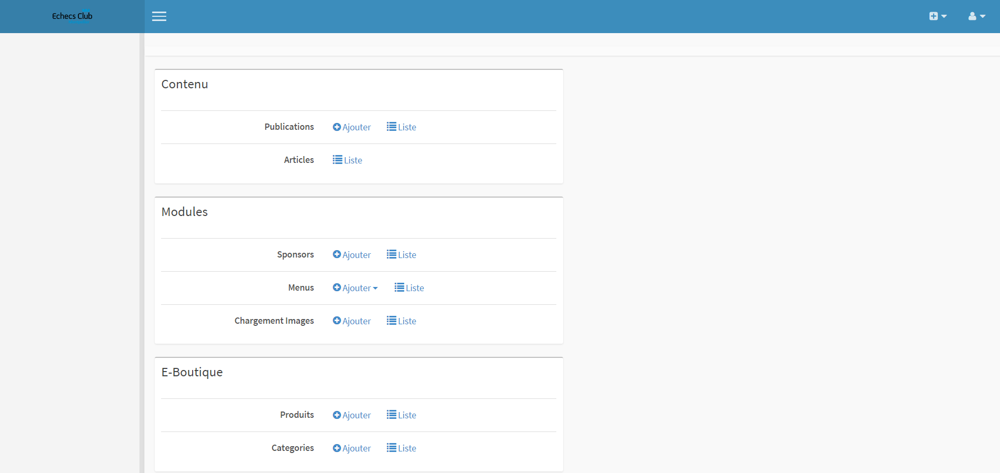

#Rapport de projet

Remerciements 
=============

Nous aimerions remercier notre tuteur Xavier Palleja pour nous avoir
guidé le long du projet tout en jouant le rôle du client exigeant et
indécis.

Nous remercions aussi Mme Gelsomino pour son aide à la rédaction de ce
rapport ainsi que M. Gautheret qui nous a initié à Symfony2.

Introduction 
============

De nos jours, un site qui n’évolue pas n’attire pas les visiteurs. et
lasse les coutumiers. Afin de garder un attrait, un site doit se
renouveler de temps en temps. De plus, selon l’interface et les
technologies utilisées la gestion de son site peut rapidement devenir
complexe et fastidieuse.

C’est dans ce contexte que le club d’échecs montpelliérain Echecs Club
Montpellier souhaite faire une refonte de son site internet afin de lui
donner un aspect plus jeune, ajouter une web-boutique et surtout
faciliter la gestion de ses publications.

En effet, le site actuel ne permet qu’une gestion minimale et
fastidieuse des articles. Avoir un back-office clair afin de gérer ses
publications ainsi que les commentaires peut rendre cette tâche bien
plus agréable et intuitive.

C’est autour de cette problématique que le club d’échecs nous a contacté
pour développer une refonte de leur site internet plus simple
d’utilisation et intégrant une boutique, en utilisant la technologie
Symfony2.

Après avoir définis le cadre du projet et les besoins généraux de
celui-ci dans l’analyse, nous détaillerons l’ensemble des
fonctionnalités, l’architecture développées pour arriver au résultat
final dans le rapport technique. Enfin nous reviendrons dans le rapport
d’activité sur les méthodes ainsi que les différents outils de travail
utilisés pour réaliser ce projet.

Analyse du contexte
===================

Le site du club d’échec de Montpellier a été développé avec Joomla pour
une mise en place facile et rapide. Jusqu’à lors le site ne permettait
qu’à des administrateurs de gérer le contenu du site.

Le club désire donc que les membres inscrits aient la possibilité de
proposer leurs propres articles et qu’une administration puisse vérifier
la pertinence de ces derniers.

L’administration pourra quant à elle, revoir l’architecture du site
(pages, menus et sous-menus) à tout moment et ainsi s’assurer de la
bonne lisibilité des informations partagées.

Le club possède une boutique physique interne et souhaiterait l’étendre
sur son site web afin d’améliorer sa visibilité et son accessibilité.
Pour cela, dans un premier temps il faudra mettre en place une vitrine
informative des produits, et, le cas échéant donner la possibilité aux
membres et aux visiteurs du site de passer leur commandes en ligne.

Analyse des besoins fonctionnels
================================

Le nouveau site développé devra inclure:

-   une vitrine présentant le club (informations essentielles,
    contact, sponsors)

-   une boutique en ligne

-   une partie administration ou back office

-   une partie publication d’articles concernant le club

L’utilisateur enregistré pourra:

-   consulter les nouveautés publiées par les autres utilisateurs
    enregistrés

-   publier des articles dans les sections autorisées

-   acheter différents produits vendus dans la boutique

L’administrateur pourra:

-   modérer les articles publiés par les utilisateurs
    enregistrés

-   modifier les informations essentielles statiques de la vitrine
    (contact, cours, organigramme, sponsors, etc.)

-   gérer la boutique

-   gérer l’architecture du site (navigation)

Analyse des besoins non fonctionnels
====================================

Contraintes techniques
----------------------

Le site devra être développé avec le framework Symfony 2.

Contraintes ergonomiques
------------------------

La charte graphique du site devra concorder avec les couleurs du club et
de la commune(bleu).

Scénarios des cas d’utilisations
================================

[use-case] 

Scénarios utilisateur non connecté
----------------------------------

### S’inscrire sur le site

1.  L’internaute clique sur le bouton « Inscription »

2.  Le système affiche le formulaire d’inscription et demande à
    l’internaute de le remplir

3.  L’internaute rempli le formulaire et appuie sur le bouton « Valider
    »

4.  Le système envoie un mail de validation d’inscription à l’internaute
    contenant la lien pour terminer l’inscription.

5.  L’internaute clique sur le lien de validation et termine son
    inscription.

6.  Le système active le compte et affiche à l’internaute que
    l’inscription s’est bien finalisée

### Se connecter

1.  L’internaute clique sur le bouton « S’authentifier »

2.  Le système affiche le formulaire de connexion

3.  L’internaute rempli les champs du formulaire de connexion et appuie
    sur le bouton « Connexion »

4.  Le système vérifie la validité des identifiants saisis précédemment

5.  L’internaute est redirigé sur la « page d’accueil » avec un message
    de bienvenue et un onglet « mon compte »

Scénarios utilisateur
---------------------

### Publier un article

1.  L’utilisateur clique sur “Proposer un article”

2.  Le système affiche un formulaire contenant les informations
    essentielles d’un menu

3.  L’utilisateur renseigne les champs du formulaire et le valide

4.  Le sytème affiche un message de validation de l’article, l’article
    ne sera affiché que si un administrateur valide l’article

### Modifier un article

1.  L’utilisateur clique sur “Mes article”

2.  L’utilisateur sélectionne l’article a modifier, le motif de refus
    est afficher

3.  Le système affiche un formulaire contenant les informations
    essentielles

4.  L’utilisateur modifier les champs du formulaire et le valide

5.  Le sytème affiche un message de validation de l’article, l’article
    ne sera affiché que si un administrateur valide l’article

Scénarios administrateur
------------------------

### Ajouter un menu/sous-menu

Ajout d’un menu

1.  L’administrateur va dans l’interface d’administration

2.  L’administrateur clique sur le bouton “Ajouter un menu”

3.  Le système affiche un formulaire contenant les informations
    essentielles d’un menu

4.  L’administrateur renseigne les champs du formulaire et le valide

5.  Le sytème affiche un message de validation de création du menu

Ajout d’un sous-menu

1.  L’administrateur va dans l’interface d’administration

2.  L’administrateur clique sur le bouton “Ajouter un sous-menu”

3.  Le système affiche un formulaire contenant les informations
    essentielles d’un sous-menu ainsi qu’une liste déroulante avec les
    diffèrent menu.

4.  L’administrateur renseigne les champs du formulaire et le valide

5.  Le sytème affiche un message de validation de création du menu

### Accéder à l’interface d’administration

1.  L’administrateur clique sur l’onglet du menu « Administration
    » (disponible que pour l’administrateur)

2.  Le système affiche la page d’administration contenant les
    liens pour administrer les différentes partie du site

3.  Le système affiche les différentes parties que
    l’administrateur peut modifier sous forme de liens

### Ajouter un sponsor

1.  L’administrateur clique sur le lien modifier les
    sponsors.

2.  Le système affiche la liste ordonnée des sponsors avec la
    possibilité de les modifier (ajout/suppression/modification)

3.  L’administrateur clique sur « ajouter ».

4.  Le système affiche un formulaire avec les informations du
    sponsor à renseigner (sous forme de formulaire : nom, lien
    hypertexte, ordre, image).

5.  L’administrateur renseigne les champs et valide
    l’ajout.

6.  Le système affiche un message de confirmation.

### Ajouter une publication

1.  L’administrateur va dans l’interface d’administration

2.  L’administrateur clique le bouton “Publication”

3.  Le système affiche les publications présents sur le site ainsi que
    l’option d’ajout d’une publication

4.  L’administrateur clique sur le bouton “Ajouter une publication”

5.  Le système affiche un formulaire contenant les informations
    essentielles d’une publication

6.  L’administrateur renseigne les champs du formulaire et le valide

7.  Le sytème affiche un message de validation de création de l’article
    dans le menu

### Refuser un article

1.  L’administrateur va dans l’interface d’administration

2.  L’adminstrateur clique sur “Article”

3.  L’administrateur clique sur l’article a refuser

4.  L’administrateur selectionne et “refuser” et met un motif de refus
    puis valide le formulaire

5.  Le sytème affiche un message de validation, l’article sera pas
    visible sur le site, l’utilisateur devra modifier sont article pour
    qu’il soit ressoumit a une validation par l’administrateur.

### Valider un article

1.  L’administrateur va dans l’interface d’administration

2.  L’adminstrateur clique sur “Article”

3.  L’administrateur clique sur l’article a valider

4.  L’administrateur selectionne et “valider” et valide le formulaire

5.  Le sytème affiche un message de validation, l’article sera visible
    sur le site

Conception
==========

Présentation des choix technologiques
-------------------------------------

### Langages de programmation

#### Langage principal

PHP5 (utilisé par Symfony2)

#### Langages de requêtes

*MySQL, DQL (Doctrine Query Language)* : langage de requête utilisé par
Doctrine dérivant du SQL. La différence majeure est que le DQL exécute
des requêtes sur des entités Doctrine au lieu de les faire sur des
tables SQL.

### Langages de structuration des données

-   *T*wig : moteur de template présent par défaut dans Symfony2

-   *H*TML5

-   *C*SS3

### Langages de configuration

-   *Y*ML : langage de configuration utilisé par Symfony2 décrivant
    plusieurs objets (attribut, valeur) servant à la configuration de
    Symfony et/ou de ses modules.

-   *X*ML

Framework et outils intégrés
----------------------------

-   *S*ymfony: Framework français écrit en PHP5, et conçu pour
    développer des applications en 3 couches, selon le modèle MVC (voir
    figure [request-flow]), permettant de produire du code propre et
    organisé.

-   *D*octrine : intégré par défaut dans le moteur de Symfony2. Il sert
    de couche de relation entre la base de données et les entités et
    permet d’interfacer les actions pouvant être appelées sur les
    entités en langage objet

[request-flow] 

Description des fonctionnalités
-------------------------------

### Création d’une publication

Une distinction a été faite entre les publications et les articles.Un
article est rédigé par un utilisateur membre. Une publication, quant à
elle, ne peut être créée que par l’administrateur du site. De ce fait,
la création se fait sur l’interface d’administration et utilise, par
conséquent, le module Sonata Admin Bundle.

#### Sonata Admin Bundle

Sonata Admin Bundle est un module pour Symfony permettant d’administrer
des entités Doctrine. Il est nécessaire d’implémenter une classe
XxxAdmin héritant de Sonata/AdminBundle/Admin/Admin contenant des
méthodes permettant de mapper les attributs de l’entité. Ce mapping est
configuré dans le fichier services.yml. La classe précisée dans
l’attribut `class` (ECM/Bundle/ArticleBundle/Admin/ArticleAdmin) sera
utilisée par Sonata pour mapper les attributs de l’entité passée en
argument dans l’attribut `arguments`
(ECM/Bundle/ArticleBundle/Entity/Article). Une fois la relation
indiquée, il reste à signaler à Sonata les éléments à afficher sur son
interface d’administration. La méthode configureFormFields indique à
Sonata quels champs de l’entité Article seront affichés lors de la
modification d’un article.

#### CKEditor

CKEditor est un éditeur de texte open source de type pouvant servir à la
création de contenu de pages web. Toute rédaction de texte liée à la
publication d’articles est faite à l’aide de CKEditor. Lors de la
création du formulaire (buildForm()), la classe “ ckeditor ” est passée
en paramètre au champ “corps” qui est de type texte. Durant la
génération du formulaire, la zone de texte du champ “corps” sera replacé
par l’interface d’édition de ckeditor (voir figure [ckeditor])

[ckeditor] 

### Administration générale

### Gestion des articles

[e-t-articles] 

#### Proposition d’un article

[proposer-article] 

Lorsque l’utilisateur demande à poster un article(voir figure
[proposer-article]), une entité Article est automatiquement créée par le
contrôleur d’articles c’est à partir de cette entité que le contrôleur
génère une vue avec les champs adaptés pour ensuite l’envoyer à
l’utilisateur.

Une fois les champs remplis, l’utilisateur appuie sur le bouton de
soumission. Le contrôleur d’article demande au de lui donner l’ qui
s’occupe alors de stocker l’entité dans la base de données
(persist(entity)), puis qui valide les changements effectués dans la
base (flush()).

L’article est alors créé, en attente de validation par l’administrateur.
Il sera donc caché jusqu’à sa validation, l’auteur pourra tout de même
vérifier l’état de son article ou le modifier à sa convence.

[seq-proposer-article] 

#### Modération d’un article

Lorsque l’administrateur demande à afficher la liste des articles pour
les administrer, le contrôleur article demande au le de l’article en
charge de récupérer les données de la base. Le contrôleur demande alors
de récupérer tout les articles (findAll()), la liste des articles est
alors renvoyée directement à la vue qui récupère les attributs
nécessaires à la liste de chacun des articles. Ces étapes sont
implicitement gérées par Sonata Admin

[liste-article] 

Une fois que l’administrateur a choisi quel article modérer, il le
sélectionne. De la même manière, le contrôleur demande au de l’article
de lui trouver l’article en question à partir de son ID
(findByID(idArticle)), de la même manière l’article est retrouné à la
vue qui génère le formulaire en fonction des attributs à afficher
(titre, auteur, corp, menu d’appartenance) (voir figure
[modif-article]).

[modif-article] 

Après lecture l’administrateur choisi soit de le valider, soit de le
refuser via les boutons radios de la page. Pour l’enregistrement des
changements, le contrôleur fait appel à l’EntityManager à qui il demande
de valider les changements fait en effectuant un flush()(voir figure
[admin-article]).

[admin-article] 

### Gestion des menus/sous-menus

#### Menus statiques

KNP Menu Bundle est utilisé pour la création et l’affichage des menus.
Le bouton “Administration” va servir d’exemple pour essayer de
comprendre le fonctionnement des menus statiques(voir figure
[btn-admin]).

[btn-admin] 

Toujours pour suivre l’exemple avec le menu “Administration”, la vue
vérifie si l’utilisateur en cours est connecté en tant que “ROLE\_ADMIN”
grâce au test is\_granted. S’il est connecté en tant qu’admin, la vue
appelle le “admin” qui se charge d’afficher le menu administrateur. Le
ecm\_home.menu.admin sert à appeler la méthode “createAdminMenu()” de la
classe MenuBuilder. Il est utile de préciser que la requête (@request)
est injectée dans le menuBuilder.

Cette méthode de la classe menuBuilder sert à la création du menu
“Administration” Le menu retourné (menu) est contruit à partir de
KNP/Menu/FactoryInterface. La fonction setChildrenAttribute sert a
appliquer la classe css ‘nav navbar-nav’ au menu, la classe ‘nav
navbar-nav’ est une classe Bootstrap, elle sert à la mise en forme du
menu. Ensuite la fonction ‘addChild’ ajoute un enfant au menu en lui
donnant en paramètre le libellé du menu (‘Administration’) et la route
qui sera appelée lors du clique sur le menu
(`route => sonata_admin_dashboard`) qui provient du fichier config.yml.
La fonction “setAttribute” ajoute un attribut de type glyphicon de
valeur “wrench” au menu. Enfin, la méthode renvoie le menu à la vue qui
se charge de l’afficher.

#### Menus Dynamiques

Il est possible de créer des menus personnalisés via l’interface
d’administration. Ces menus peuvent également contenir des sous-menus.
Pour gérer ce type d’architecture, un héritage entre menu et sous-menu
est nécessaire.

Le processus d’affichage avec KNPMenuBundle ainsi que le utilisé pour
générer le menu sont les mêmes que pour les menus statiques.

#### Héritage

L’héritage se configure dans les classes des entités Doctrine (Menu et
SubMenu en l’occurrence). `Inheritance Type` sert à déterminer comment
Doctrine converti cet héritage en tables SQL (soit `JOINED`, ou
`SINGLE_TABLE`). Ici, `JOINED` fait en sorte que deux tables soient
crées (Menu et SubMenu). Menu contient un attribut discriminant
(spécifié dans `Discriminator Column`) faisant la différence entre un
Menu et un SubMenu. Lorsque ce discrimant vaut “menu”, doctrine sait que
c’est un menu. Au contraire lorsqu’il vaut “submenu”, il sait que c’est
un sous-menu et référence directement ce sous-menu dans l’autre table
SQL SubMenu contenant tous les attributs spécifiés dans SubMenu et pas
dans Menu.

#### Conteneur de Menus

Un jouant le rôle d’un permet d’accéder aux menus contenus dans la base
de données depuis le MenuBuilder de KNP.

Deux méthodes sont implémentées :

-   getMenus permettant de récupérer tous les menus (et seulement les
    menus)

-   getSubMenus permettant de récupérer tous les enfants d’un menu

La configuration de ce service se situe dans le fichier services.yml du
bundle HomeBundle. Grâce à ce fichier, le est enregistré par le kernel
de Symfony dans le .

#### Affichage des menus et sous-menus

Pour afficher les menus et sous-menus, la fonction `generateMenu()`
parcourt le tableau de menus renvoyé par le conteneur de menus
(`getMenus()`). Pour chaque menu, tous ses potentiels enfants sont
récupérés et sont ajoutés en tant qu’enfant, via `addChild()`, au menu
parent.

#### Slugify

Slugify est un petit module permettant de créer des slugs (jetons
fabriqués à la volée à partir de chaînes de caractères). En l’occurence,
ce module est utilisé pour générer des chaînes de caractères compatibles
aux URLs (pour les menus).

### Gestion des utilisateurs

Cette partie a été développé à l’aide du bundle FOSUserBundle.

#### FOSUserBundle

FOSUser sert à la gestion des membres (inscription / connexion /
déconnexion / changement de mot de passe ) Un UserBundle a été développé
pour gérer les utilisateurs. Ce étend de FOSUser, il hérite donc de
toutes les méthodes et les fonctionnalités que propose FOSUserBundle. La
mise en place de ce est simple: il suffit de spécifier la classe que
l’on veut faire hériter de FOSUser UserBase.

### Gestion des sponsors

La gestion de l’administration des sponsors est la même que pour les
autres fonctionnalités (mapping de l’entité et configuration des champs
affichés dans une classe `XxxAdmin`). Cependant, la gestion des sponsors
nécessite un petit module permettant d’ordonner la position des
sponsors.

#### Pix Sortable Bundle

Pix Sortable Bundle est un qui permet de trier et d’ordonner toute sorte
entité. Pix Sortable Bundle sert à l’ordonnancement des sponsors, c’est
à dire qu’il est possible de modifier l’ordre d’affichage des sponsors.
Une petite fonction intégrée à `SponsorAdmin` permet d’interfacer ce
module avec Sonata

Résultats et perspectives
=========================

Résultats
---------

### Vitrine

Le site contient une vitrine servant à présenter le club aux futurs
adhérents ou aux personnes recherchant des informations sur le club.
Mais aussi aux adhérents qui veulent se tenir informés des différentes
news et évènements.

L’administrateur peut ajouter, modifier ou supprimer des publications ce
qui rend la vitrine parfaitement dynamique.

### Inscription d’un membre

Les internautes désirant s’inscrire au site, peuvent le faire via un
formulaire dédié. Les inscriptions doivent être validées par mail ce qui
a pour but d’empêcher les robots de s’inscrire.

Une fois inscrit, un utilisateur peut modifier sont mot de passe via le
formulaire adéquat.

### Gestion des articles/sponsors

Le site permet à l’administrateur de gérer les sponsors. Il permet d’en
créer, de les modifier, ou de les supprimer, mais aussi de trier l’ordre
d’affichage, en fonction de leur importance, les sponsors affichés sur
le site (amenant sur le site web du sponsor).

Le site possède un système de publication et de modération des articles,
un utilisateur inscrit peut proposer un article, via un formulaire
correspondant. Cet article une fois validé est soumis à la modération de
l’admin. Si l’article et accepté, il sera affiché sur le site. Dans le
cas contraire l’utilisateur est invité à modifier son article.

### Gestion des catégories/produits

Le site contient la liste des produits vendus par le club en fonction de
leur catégorie. Ces produits et ces catégories sont donc administrables,
l’administrateur peut créer, modifier ou supprimer des catégories. Le
site permet la création, la modification et la suppression des produits,
les produits appartiennent à une catégorie.

Perspectives
------------

### Boutique

Dans une évolution future, il sera utile d’ajouter un panier et de
finaliser la partie boutique du site web, pour que les utilisateurs
puissent acheter les produits directement sur le site web.

### Gestion d’équipes

Il serait aussi possible d’ajouter une partie “équipes”, pour faciliter
la gestion de ces dernières par les chefs d’équipe lors de
l’organisation de tournois.

### Gestion des membres/inscription

Il faudrait rajouter une gestion des membres ainsi qu’un système
permettant seulement aux adhérents du club de s’inscrire au site, ou de
poster des articles. Une réunion avec le client devrait se faire pour
décider de la solution la plus adaptée.

#### Gestion des itérations

Pour le démarrage du projet, nous avons fait une réunion avec notre
tuteur, M. Palleja où nous avons discuté de ses attentes et du contenu
global du projet. Nous avons fait un rapport préliminaire afin de bien
vérifier la bonne compréhension du sujet que nous avons rendu la semaine
suivante. Lors de la réunion qui suivi le rendu du rapport nous avons pu
débattre des idée et proposition que nous avions à faire avant de nous
lancer totalement dans le projet.

Par la suite, nous avons suivis une démarche agile en travaillant par
itérations de deux semaines durant la période de cours, et en réduisant
ce délais de moitié pour les dernières semaines consacrées au projet.
Pour l’intégration nous avons utilisé le gestionnaire de version Git que
nous avons intégré à nos Environnements de développement . Nous avons
mis en place un Kanban via la site de Trello pour nous répartir les
tâches lors des premières itérations.

#### Difficultés rencontrées

Mais, face aux difficultés techniques que nous avons rencontrées quant à
l’utilisation de Sonata, nous nous sommes regroupés derrière un seul
codeur pour comprendre le fonctionnement de Sonata et le mettre en
place… Une fois ceci fait, nous avons réussi à nous diviser en deux
équipes afin de terminer la mise en place de la gestion des articles et
de la boutique.

#### Conclusion

En revenant sur notre progression, il aurait été préférable de ne pas
utiliser Sonata Admin Bundle pour la gestion du site car, bien que ce
module soit performant, l’équipe ne possédait pas les compétences
nécessaires pour sa mise en place dans un délai acceptable. De plus, le
module possédait énormément de fonctionnalités superflues pour notre
projet. Une recherche plus approfondie d’un autre module, voire s’en
passer aurait sûrement été préférable. D’un autre coté, d’un point de
vue pédagogique l’installation de Sonata nous a permis de mieux
comprendre le fonctionnement de Symfony2 et de l’installation de
modules, l’installation de Sonata n’a pas été une totale perte de temps.

Accéder à l’interface d’administration
======================================

Pour pouvoir accéder au back office il faut dans un premier temps, se
connecter avec un compte administrateur (voir figures
[accueil-btn-connexion] et [connexion]).

[accueil-btn-connexion] 

[connexion] 

Une fois connecté il faut cliquer sur le bouton Administration du menu
(voir figure [accueil-btn-admin]).

[accueil-btn-admin] 

Ensuite le site redirige automatiquement vers le back office (voir
figure [backoffice]).

[backoffice] 

Le back office est constitué de trois blocs, le premier bloc “contenu”
va servir à ajouter/modifier/supprimer une publication et à la
modération des articles postés par les utilisateurs.

Ensuite le second bloc, intitulé “modules” sert à
ajouter/modifier/supprimer/ordonner les sponsors, les menus, les sous
menu ,et a l’envoi d’images sur le serveur.

Pour finir, le dernier bloc sert à la gestion de la boutique, c’est dire
à ajouter/modifier/supprimer des produits et des catégories.

Le fonctionnement du back office est sensiblement identique pour chaque
item du site. Tous ces items à l’exception des Articles ont un bouton
“ajouter” qui permet d’être redirigé vers le formulaire d’ajout
correspondant à l’item. Il est aussi possible d’avoir la liste de toutes
les entités par item. Par exemple : le bouton liste de la catégorie
publication affichera la liste de toutes les publications qui sont
enregistrées sur le site. La page liste permet de modifier et de
supprimer une entité de l’item sélectionné La modification se déroule
via le même formulaire que l’ajout, à la différence que, les champs sont
pré-remplis avec les valeur de l’entité modifiée.

Pour illustrer le fonctionnement du back office, l’administration d’une
publication et des sponsors vont être détaillés.

Administration des publications
===============================

Lors du clique sur le bouton liste le système affiche une page avec
toutes les publications du site, chaque publication est modifiable et
supprimable via les boutons prévu à cet effet. Il est possible aussi de
modifier un article en cliquant sur son titre (voir figure
[liste-publication]).

[liste-publication] 

Lorsque l’on souhaite modifier un article , le système nous redirige
vers la page de modification. Sur cette page il est possible de modifier
le titre via la zone de texte correspondante, le corps du texte, quand a
lui se gère via un champ CKEditor (dont nous avons détaillé le
fonctionnement précédemment ). Il est aussi possible de modifier le menu
dans lequel la publication sera affichée, la liste déroulante
correspondante contient les menus du site.

Pour valider on peut soit cliquer sur “Mettre à jour“ pour valider et
rester sur la même page, soit cliquer sur “Mettre à jour et fermer” ce
qui enregistre les modification et renvoie sur la liste des
publications.

Le bouton supprimer sert, quant à lui, à supprimer la publication (voir
figure [modif-publication]).

[modif-publication] 

Il est aussi possible d’ajouter une publication via le bouton “Ajouter”,
sur la page d’accueil du back office, l’ajout d’une publication se fait
via le formulaire suivant, dont le fonctionnement ne diffère pas de la
modification (voir figure [ajout-publication]).

[ajout-publication] 

Administration des sponsors
===========================

Pour ajouter un sponsor il faut cliquer sur le bouton “ajouter” de la
page d’accueil du back office dans la partie sponsor du bloc “module”,
le système nous affiche alors le formulaire adéquat.

Il suffit alors de renseigner le titre, le lien vers lequel pointera le
sponsor, l’image qui s’affichera (l’image n’est pas obligatoire) ainsi
que sa position (voir figure [ajout-sponsor]).

[ajout-sponsor] 

La modification se fait via un formulaire sensiblement identique.

Il est aussi possible de modifier la position d’un sponsor de façon
dynamique sur la page liste des sponsors, il suffit de cliquer sur les
flèches pour faire monter ou descendre les sponsors (voir figure
[liste-sponsor]).

[liste-sponsor] 

Conclusion {#conclusion-1 .unnumbered}
==========

Nous avons réalisé le projet demandé en grande partie mais beaucoup
d’améliorations et d’évolutions restent possibles, en effet, le site a
fait peau neuve, possède une interface d’administration simple
d’utilisation pour gérer l’architecture et le contenu du site, et permet
à ses membres de poster (avec vérification préalable) des articles. Une
vitrine permetant de présenter les produits a elle aussi été mise en
place. En revanche, un panier pourrait être envisagé pour permettre aux
utilisateur de faire leur commande en ligne. Cependant, certaines
fonctionnalités n’ont pas pu être réalisées comme par exemple la gestion
des équipes et une gestion plus approfondie des inscriptions.

Dans l’ensemble ce projet nous à permis de mieux appréhender les
mécaniques de fonctionnement de Symphony, et nous a appris à nous méfier
de l’installation hâtive de modules. Le travail en équipe nous a aussi
poussé à utiliser des outils de travail communautaires (Git, Trello) qui
sont largement utilisés en entreprise pour la gestion de projet.

Script SQL phpmyadmin
=====================

Diagramme des classes
=====================

Le Projet ECMCHESS consiste à réaliser un site web vitrine pour un club
d’échec montpellierain. Ce dernier devait pouvoir fournir divers
informations sur le club, informer ses membres et permettre l’achat de
matériel d’échec via une boutique en ligne Le site a été développé en
utilisant le framework Symfony 2 ainsi que des modules notamment
Bootstrap et Sonata. mots-clés : Échecs, Club d’échec, Symfony 2,
boutique en ligne.

ECMCHESS project consists in developping a website for a chessclub of
Montpellier. It was aimed to show various inforation about the club,
display news and events to the club’s members and allow customer to buy
chess’s stuff on an online store. This web site has been developped
using the Symfony 2 framework and bundles for instance Bootstrap and
Sonata.

key words : Chess, chess club, symfony 2, e-shop.
